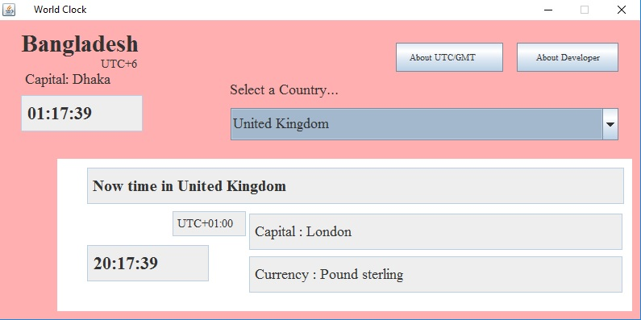
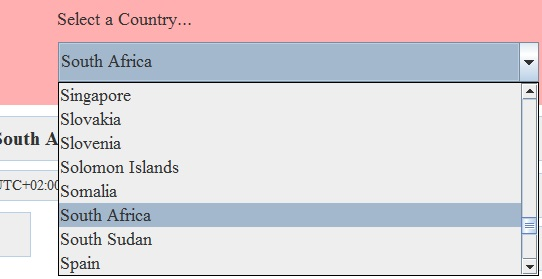

# World_Clock
A java project that tells you about Time, Capital, UTC/GMT Standard and Currency of any country selected.

This software mainly works in Bangladesh(GMT+6) because it takes the system time and changes it to other country's time comparing Bangladesh.

I've finished this project about two years ago and I'm not interested to improve it anymore.

_Screenshot-1_

_Screenshot-2_                                                                          

